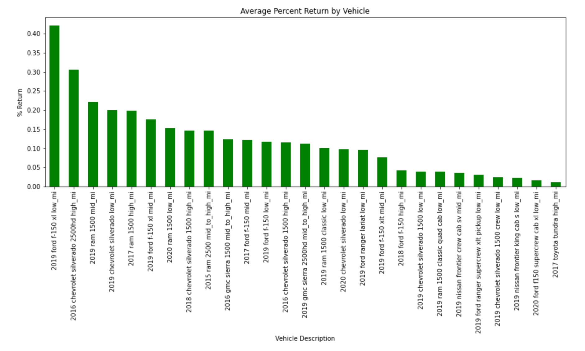

# car_arbitrage
Car arbitrage analysis 
______________________________
## Q1: Are there arbitrage opportunities?

___________________________
## By location?
Choose one state in west coast, one in east coast, and one in midwest
CA - 

WI - 

FL - 

__________________________
## By specific manufacturers?
Ford

Dodge

GMC

Chevy

__________________________
## Recommendation

Based on the visualizations, we recommend the client focus on a combination of vehicle and location, Dodge in the midwest. Economies of scale as a result discounted freight. 