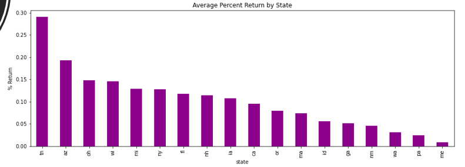
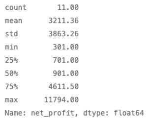
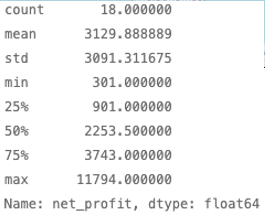

# car_arbitrage
This project seeks to answer three questions:

1) Are there arbitrage opportunities to import trucks into Texas from the lower 48 states?

2) If so, which geographic regions offer the best opportunities?

3) Which vehicles offer the best arbitage value?

We look to answer these questions by analyzing a publically available data set found on Kaggle:
Reese, A. (2021, May 6). Used cars dataset. Kaggle. Retrieved February 5, 2022, from https://www.kaggle.com/austinreese/craigslist-carstrucks-data?select=vehicles.csv 

---

## Technologies

This program/notebook should be viewed in jupyter lab and the following libraries were used:

Pandas,
Pathlib,
Mathplotlib,
hvplot
Numpy
ipynb

---

## Installation Guide

To install any of the libraries not in your environment, type:

pip install *new library name*

---

### Usage

This notebook is static from a data perspective. All of the necessary .csv files are located in the 'Resources' subfolder. 

Some of the graphs and visualizations are done in hvplot. 

The graphs displayed are dynamic. They utilize hvplot which allows the user to manipulate the disply by accessing the toolbar found on the right side of the graph.

The top button will bring you to the Bokeh Visualization Library homepage.

The next button will allow you to grab and move the chart if you left click and hold.

The magnifying glass allows the user to zoom in to a particular portion of the chart for a closer look by left clicking and draging a box around the relevant data.

The magnifying glass next to the image of the mouse wheel will enable you to zoom in and out with your mouse wheel if selected.

The disk button will allow you to save a copy of the chart to your computer.

This button will reset the chart to it's default display.

The final button will toggle the hover information on/off. Selecting this will allow you to see more information as you hover your mouse over the chart.
______________________________
## Q1: Are there arbitrage opportunities?

a whisker plot which shows the distribution of values of arbitrage opportunities nationwide

The details of the national arbitrage opportunities

a visualization of the location of the arbitrage opportunities plotted on a map

This plot shows the number of opportunities by vehicle type

This chart shows the percent return that the arbitrage could acheive grouped by state. One should be careful in placing too much stock in this visual, as it does not take into account the number
of trucks in each state. For example, the TN return of almost 30% is representative of just 1 vehicle.

This chart shows the average net profit acheivable in each state. The same cares expressed above should be taken with this chart.

___________________________
## Q2 By location?
We chose one state on the west coast, one on the east coast, and one in the midwest to compare the arbitrage opportunities by region. Criteria was that there were multiple vehicles available the could be arbitraged. The logic there was that if you could load multiple vehicles from the same state on one car carrier, you should be able to get advantaged freight, and acheive some economies of scale.

CA - 

The trucks available in the state of California

WI - 

The trucks available in the state of Wisconsin

FL - 

The trucks available in the state of Florida

__________________________
## Q3 By specific manufacturers?
Ford

Ford had the most trucks numerically. However, many of the Ford Trucks had minimal arbitrage value so Ford was the manufacurer with the lowest average arbitrage value.

Dodge

There were a good number of Dodge trucks that could be arbed into Texas. The values were fairly consistent, and Dodge had the greatest average arbitrage value.

GMC

GMC had good economic numbers. However, there were only 3 trucks that met our criteria.

Chevy

Chevrolet was interesting. The max profit was greater than all the other manufacturers, but the mean was only better than Ford. This tells us that Chevy trucks are more likely
to provide lower arbitrage value than GMC or Dodge, but there may be opportunities to cherry pick chevy trucks to make great returns.

__________________________
## Conclusion

**Question:** After reviewing the profit information across each car type from the different states, can you identify any patterns or trends? Are there any arbitrage opportunities for buying cars nationally and reselling the cars in Texas?

**Answer:** 
1.	Are there truck arbitrage opportunities for re-sale in Texas?

    I.	Yes, we are recommending Gen Z & Co further choose to apply working capital towards gain access to a reputable API. 
    II.	One such example is Auto-Trader, this company host an API which contains a good mix of dealer and private individuals sell vehicles.
    III.	 This would be a great way to aggerate opportunities for arbitrage and consolidate transportation based on geographic location, popular brands and/or best profit margins. 
    
2.	What are the best arbitrage opportunities by location?

    I.	By geographic location, the best opportunities lie in the Midwest region. 
    II.	We recommend care when dealing with this region as it is commonly known as the rust belt. 
    III.The Midwest has the highest rate of truck value depreciation, when comparing with the same trucks in Texas. This region presents the best opportunity. 
        I.	Stick to the newer, lower milage vehicles to mitigate risks. 
        
3.	Which specific manufacturers offer the greatest arbitrage margins?

    I.	We found Dodge trucks, in the Ram model present the best opportunity due to rapid depreciation. 
        I. A minimum of $900.00 with a mean net profit of  around $5000.00, and potential max net profit of around $12,000.00.
        II. Chevy is the next best arbitrage opportunity.

---

## Contributors

Jas Pinglia - https://github.com/jpinglia ; https://www.linkedin.com/in/JPinglia/
Angela Richter - https://github.com/angie0920
Neil Mendelow - https://github.com/nmendelow ; https://www.linkedin.com/in/neil-mendelow/ 
Thuy Nguyen - https://github.com/nguyenthuyt

---

## License

This code is covered by the MIT license.